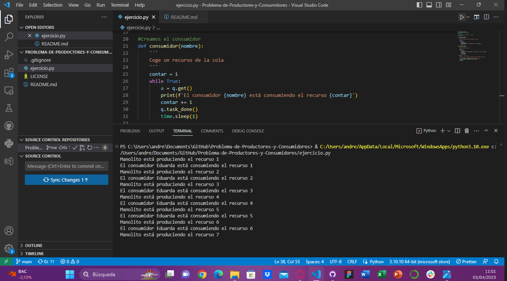

# Problema-de-Productores-y-Consumidores

Mi dirección de GitHub para este repositorio es la siguiente: [GitHub](https://github.com/andmansim/Problema-de-Productores-y-Consumidores.git)

https://github.com/andmansim/Problema-de-Productores-y-Consumidores.git

Concepto de Productor y Consumidor: 
El productor aporta los recursos y el consumidor usa esos recursos, pero esto lo deben de hacer en equilibrio. El problema es cuando uno de los dos tarda más en crear o consumir dichos recursos, dado que ocasiona un desequilibrio.
La solución a este problema es usar gestión de recursos o exlusión mutua en equilibrio, que lo haremos mediante hilos. Usaremos una cola para conectar al productor con el consumidor. Además, de establecer un tiempo de espera, para que no haya una latencia muy grande.

Crearemos dos hilos, uno el consumidor y otro el productor, para que se hagan de forma paralela y reducir el tiempo de espera. Esto es posible porque están separados, es decir, son independientes

Todo este ejercicio está hecho asumiendo que solo hay un productor y un consumidor.
```
from queue import Queue
from threading import Thread
import time

#creamos la cola que almacena los recursos
q = Queue(10)

#Creamos el productor
def productor(nombre):
    '''
    Añade los recursos que crea el productor a la cola
    '''
    contar = 1 
    while True:
        q.join()
        q.put(contar)
        print(f'{nombre} está produciendo el recurso {contar}')
        contar +=1
        
#Creamos el consumidor
def consumidor(nombre):    
    '''
    Coge un recurso de la cola
    '''
    contar = 1
    while True:
        a = q.get()
        print(f'El consumidor {nombre} está consumiendo el recurso {contar}')
        contar += 1
        q.task_done()
        time.sleep(1)
        
if __name__ == '__main__':
    '''
    Creamos los hilos de ambas funciones para que se ejecuten en paralelo
    '''
    t = Thread(target = productor, args = ('Manolito', ))
    t1 = Thread(target = consumidor, args= ('Eduarda', ))
    t.start()
    t1.start()    


```

